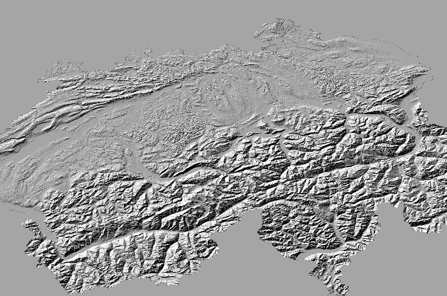

# Digital Elevation Model for Switzerland [](https://github.com/lukasmartinelli/swissdem#license)

You are looking for a [Digital Elevation Model (DEM)](https://en.wikipedia.org/wiki/Digital_elevation_model) of Switzerland?
Here you find preprocessed [GeoTIFF](-of PNG) downloads for Switzerland from the [Shuttle Radar Topography Mission (SRTM)](https://en.wikipedia.org/wiki/Shuttle_Radar_Topography_Mission)
and provides a resolution [up to 25 meters (1 arc-second)](https://lta.cr.usgs.gov/SRTM1Arc). At the moment this is the most accurate public domain DEM for Switzerland.

[**:open_file_folder: Download the GeoTIFF files from the releases page**](https://github.com/lukasmartinelli/swissdem/releases/latest).

This project merges together the different data sets from SRTM (1 arc-second) into a single DEM TIFF
so you can immediately get started creating your own contour lines, hillshading, etc. It also tries to repair (fill up void) data holes in the SRTM (1 arc-second) data.

## Downloads

A graphical overview of the [prepared downloads](https://github.com/lukasmartinelli/swissdem/releases/latest).

### Clipped and Unclipped DEM

The DEM from SRTM (1 arc second) with filled up holes is available in clipped and unclipped format (useful if you want to derive contour lines or larger area than Switzerland).


### Hillshading

Basic hill shading for direct use in a mapping client.



### Slope Shading

To make steep slopes stand out we use `gdaldem slope` and `gdaldem color-relief` to
create a TIF that can be combined with hillshading in a map renderer.


### Color Relief

Color relief assigning colors to elevation data to enhance elevation zones so map readers
can better see differences in relief.


### Slope

Generated using `gdaldem slope` to create a TIF where each pixel value is a degree, from 0 to 90, representing the slope of a given piece of land. The slope file is used as input for slope shading.


## Run Workflow

Build the Docker image (skip this step if you want to use the prebuilt image).

```
# pull the image
docker pull lukasmartinelli/swissdem
# or build the image yourself
docker build -t lukasmartinelli/swissdem .
```

The SRTM (1arc-second) DEM sources which are merged together are compressed GeoTIFFs downloaded from [USGS](http://earthexplorer.usgs.gov).  You can create the merged and clipped DEM GeoTIFF of Switzerland yourself by running Docker container.
Afterwards you will find the all the processed files in your current working directory.

```
docker run -v $(pwd):/output --rm lukasmartinelli/swissdem
```

## License

The GeoTIF files are made available under the Public Domain Dedication and License v1.0 whose full text can be found at: http://www.opendatacommons.org/licenses/pddl/1.0/.
